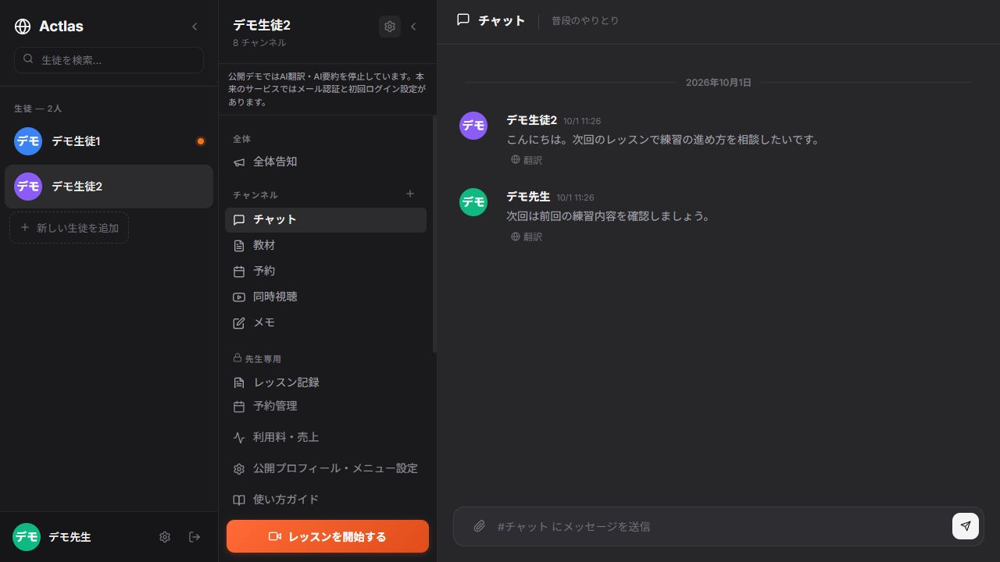
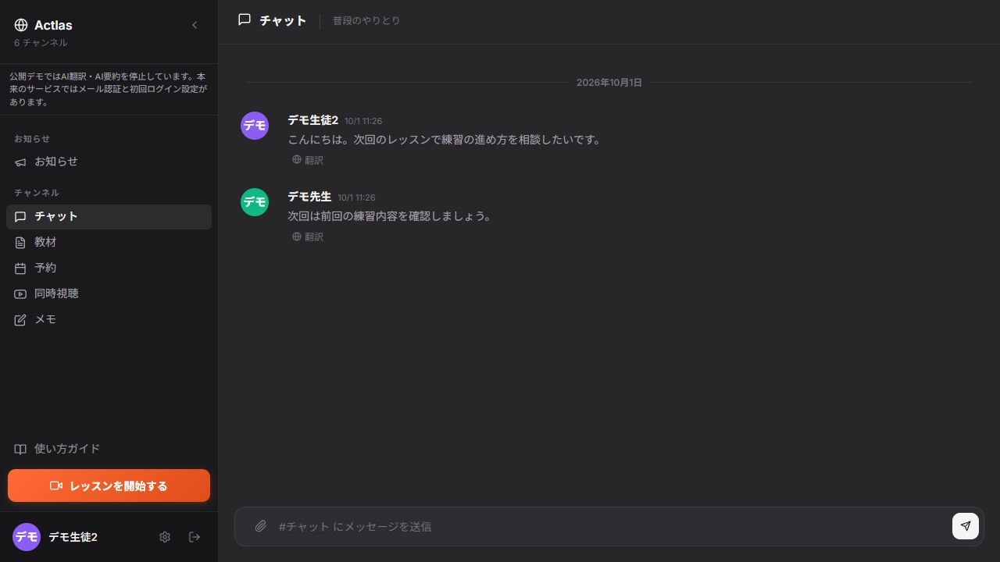

# Actlas — オンラインレッスンの統合ワークスペース

AIを活用して開発した、オンラインレッスン用のWebアプリです。レッスン中の通話・チャットと、レッスン前後の教材共有・予約・記録をひとつにまとめています。先生が生徒ごとのルームを持ち、先生専用の記録と生徒に見せる内容を分けて扱います。

## 画面



先生の画面で、生徒別ルーム、チャット、教材、予約、レッスンの記録をまとめて扱います。

<details>
<summary>生徒の画面</summary>



</details>

## 主な機能

- 先生・生徒で表示と操作範囲が変わるワークスペース
- 生徒別ルーム、チャット、教材ファイル共有、ピン留め・返信
- 告知、既読、リアクション、レッスンの記録・ダッシュボード
- タイムゾーンに対応した予約、先生の予約管理、ブロック枠
- WebRTCによる映像・音声通話、マイクと楽器の入力、複数カメラの合成
- 通話中も教材やチャットを使える分割表示
- 先生プロフィール、レッスンメニュー、PWA

## 技術構成とコードの見どころ

Next.js 16.2.6 / React 19 / TypeScript / Tailwind CSS 4 / Prisma 5 / PostgreSQL / Socket.IO / WebRTC / Web Audio API。

Socket.IOとNext.jsを同じHTTPサーバーで扱うカスタムサーバー構成です。画面、API、リアルタイム通信、データ構造を含めた設計は[技術構成](docs/ARCHITECTURE.md)にまとめています。

| 見どころ | 主なコード |
| --- | --- |
| 先生・生徒別の画面と生徒別ルーム | [app/page.tsx](app/page.tsx) |
| 通話を続けながら教材やチャットを表示 | [LessonView.tsx](app/components/LessonView.tsx) |
| WebRTC、マイク・ギター入力、複数カメラ | [webrtc.ts](lib/webrtc.ts)、[audio.ts](lib/audio.ts)、[multicam.ts](lib/multicam.ts) |
| リアルタイム送受信とルームのアクセス制御 | [server.ts](server.ts) |
| タイムゾーンと予約の管理 | [予約API](app/api/reservations/route.ts)、[BookingView.tsx](app/components/BookingView.tsx) |
| 認証、セッションの検証 | [auth.ts](lib/auth.ts)、[ログインAPI](app/api/auth/login/route.ts) |
| データ構造とデモデータ | [schema.prisma](prisma/schema.prisma)、[seed.ts](prisma/seed.ts) |

## デモでの制限

APIキーなしで主要機能を試せるよう、以下の機能はデモでは停止しています。元の機能の実装はコードで確認できます。

| 機能 | 本来の動作 |
| --- | --- |
| 翻訳 | 会話を翻訳字幕として表示し、メッセージも翻訳する。 |
| AI要約 | レッスンの字幕ログから振り返り・練習内容・課題を整理し、先生専用のレッスン記録に保存する。 |
| 初回設定・メール認証 | 先生のログイン時にメール認証を行い、生徒には初回プロフィール設定を求める。 |

パスワード確認、JWTによるセッション、先生・生徒・ルームのアクセス制御は有効です。決済・実メール送信・Web Pushもデモの確認対象外ですが、無料メニューで予約を試せます。

## ローカル起動

必要なもの: Node.js 20.9以上（推奨22）、npm、Docker Compose。このリポジトリをcloneし、フォルダ内で実行してください。

```sh
npm ci
npm run demo:setup
docker compose up -d --wait
npm run db:generate
npm run db:setup
npm run dev
```

ブラウザで [http://localhost:3100](http://localhost:3100) を開き、**「デモ先生としてログイン」** または **「デモ生徒としてログイン」** を押します。メールアドレス・パスワードの入力やAPIキーは不要です。

先生は生徒2名のルームを管理でき、生徒はデモ生徒1の画面を体験できます。いずれも架空のアカウントです。`demo:setup` が接続設定とサーバー側の認証に使う値を `.env` に生成します。

### 操作例

1. 「デモ先生としてログイン」を押し、生徒別ルーム・教材・レッスン記録を確認する。
2. 別のブラウザかプライベートウィンドウで「デモ生徒としてログイン」を押し、同じルームでチャットする。
3. 生徒には先生専用チャンネルが表示されないことを確認する。
4. 「無料デモレッスン」で予約の流れを試す。
5. カメラ・マイクを許可し、通話と分割表示を試す。

同じPCで通話を試す場合はイヤホンを使用してください。ブラウザやOSによって同一カメラを2つの画面で使えない場合があります。通話の音声品質や別ネットワークでの接続には、利用環境に合わせた確認が必要です。

## 品質確認

```sh
npm run lint
npm run typecheck
npm run test:public
npm run build
```

サーバー起動中に別のターミナルから `npm run test:smoke` を実行すると、先生・生徒のアクセス制御、Socket.IOでの投稿、停止したAPIの応答を確認できます。テスト投稿はデモDBに追加されます。

GitHub Actionsには、lint・型チェック・テスト・ビルド・API確認と、Semgrepによる静的解析、Gitleaksによる秘密情報検出を設定しています。実施済みの確認と未確認の範囲は[検証記録](docs/VERIFICATION.md)に記載しています。
