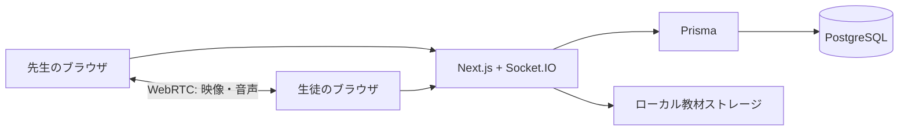

# 技術構成とコードの読み方

## 全体

画面とHTTP APIはNext.js App Router、メッセージと通話シグナリングはSocket.IO、映像・音声はWebRTCで扱います。カスタムサーバーの起動点は `server.ts` です。WebRTCではSTUNを利用して接続候補を収集します。APIキーを使うAI処理とは別の通信です。

## データの分離

- User: 先生・生徒の役割、パスワードのハッシュ、セッションバージョン。
- Room: 先生が所有し、ひとりの生徒に紐づくルーム。
- Channel: ルーム内のチャット・教材・予約・記録など。先生専用のフラグを持つ。
- Message / File: 会話と添付ファイル。チャンネルに紐づく。
- Reservation / BlockedSlot: 予約、予約を受け付けない時間、リマインダー状態。
- TeacherProfile / LessonMenu: 公開プロフィールとメニュー。
- Announcement: 告知、既読、リアクション、通知再試行の状態。

詳細は `prisma/schema.prisma` を参照してください。公開版の初期マイグレーションはこのスキーマから生成しています。元の運用履歴や本番DBは持ち込みません。

## 認証とリアルタイム通信

`lib/auth.ts` はbcryptでパスワードを検証し、JWTをhttpOnly Cookieに保存します。APIとSocket接続時にはDB上の役割・セッションバージョンも照合します。チャンネル参加時には所有する先生、ルームに所属する生徒、先生専用フラグを確認します。

デモのログイン画面は先生・生徒の2つのボタンで役割を選びます。`app/api/auth/login/route.ts` が固定の架空アカウント、ID・役割、専用ローカルDBを確認し、環境変数のパスワードで認証します。パスワードをクライアントへ渡さず、JWTとルーム単位の認可を維持します。先生のメール認証は `lib/public-demo.ts` の条件で省略しています。

## 通話と画面

`LessonView.tsx` が通話中のUIを管理し、`lib/webrtc.ts` が接続、`lib/audio.ts` がマイク・楽器の入力、`lib/multicam.ts` がCanvasへの複数カメラ合成を扱います。

通話画面は単一のインスタンスを維持し、分割表示への切り替えで通話を作り直さない構成です。音声ノード、カメラトラック、アニメーション、接続を終了時に解放する必要があります。

## 予約

予約時刻はUTCの絶対時刻で比較し、利用者のタイムゾーンに合わせて画面に表示します。予約APIは競合の確認とトランザクションを持ちます。公開版のメニューは無料として作成し、外部決済を使わずに予約の流れを確認します。

## 本来のAI連携

会話の翻訳は `lib/translate.ts`、セッションの準備・テキスト翻訳・要約は `server.ts` にあります。要約は先生専用のレッスン記録チャンネルへ投稿する実装です。公開版ではUIとサーバーの双方で停止し、キーの設定有無に関係なく実行しません。

## 公開版の境界

サーバーはlocalhostにだけ待ち受けます。起動前・DB初期化前に専用の `actlas_demo` DBを確認します。環境変数、本番デプロイ、運用固有の図や記録、実画像は公開コードへ移していません。
